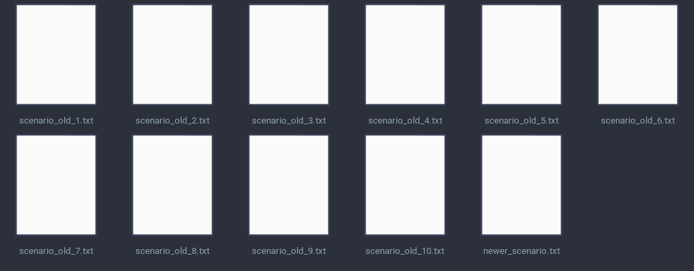

+++
title = "Git Gud dengan Git"
date = "2024-10-06T13:09:21Z"
author = "arxnoire"
authorTwitter = "" #do not include @
cover = "cover.png"
tags = ["perkenalan", "git", "versioncontrolsystem"]
keywords = ["Git", "Version Control System", "Github"]
description = "Mari belajar tentang Git, alat bantu dasar yang membantumu untuk mengelola perubahan kode dengan mudah."
showFullContent = false
summary = "Pengenalan Git Untuk Pemula"
readingTime = true
hideComments = true
+++

## Git, sebuah alat yang memudahkanmu untuk _git gud_ pada version control.

Git, telah menjadi hal yang populer di kalangan pengembang selama beberapa tahun, namun begitu banyak orang yang masih belum mengetahui apa itu Git. Kalian mungkin pernah menemukannya saat menelusuri media sosial, atau mungkin forum seperti stackoverflow, di mana orang-orang cukup sering menyebutkannya dalam komentar atau postingan mereka seperti _“Hey, coba lihat ini, proyek Github terbaru ku, kalian bisa gunakan git untuk mengambil dan memodifikasinya sendiri”_ atau hal lain yang menyebutkan Git atau Github.

Mungkin kalian berpikir, “Apa yang membuat Git begitu istimewa?”, “Mengapa begitu banyak orang yang membicarakannya?”, atau “Apa untungnya bagi saya jika saya mulai menggunakannya?” Jangan khawatir, kamu tidak sendirian, karena saya juga memiliki pertanyaan yang sama saat pertama kali mengenal Git :)

Dalam artikel ini, kita akan memperjelas apa itu Git, mengapa Git menjadi alat yang sangat penting dalam industri pemrograman, tetapi bagaimana dengan Github? Itu bisa dipelajari nanti, karena Git dan Github sangat terkait satu sama lain, jadi pada saat kalian belajar Git, Kalian akan terbiasa dengan Github juga, dan percayalah, Github dapat membuat hidup kalian sebagai seorang programmer menjadi lebih mudah.


Jadi, Git adalah sistem kontrol versi terdistribusi, yang memungkinkan kalian untuk memantau perubahan pada kode kalian dari waktu ke waktu, yang pada akhirnya memudahkan untuk melihat apa yang telah diubah dan oleh siapa (meskipun hanya diubah oleh kalian sendiri, hal ini dapat membingungkan jika kalian memiliki banyak revisi). Git sangat ideal untuk berkolaborasi dengan developer lain karena memungkinkan semua orang untuk mengerjakan proyek yang sama tanpa berselisih. Git juga membuat kalian dapat mempertahankan banyak versi proyek kalian, memungkinkan kalian untuk mencoba ide-ide baru tanpa mengacaukan proyek utama, kembali ke versi sebelumnya, atau mengerjakan banyak fitur pada saat yang sama tanpa kehilangan progress.

# Mengapa aku harus menggunakannya? aku biasa saja dengan beberapa file berbeda yang mewakili versi yang berbeda

Yah, kalian mungkin mengatakan bahwa ketika kalian memiliki kurang dari 15 revisi file yang berbeda, tetapi bagaimana jika kalian ingin melakukan rollback dengan cepat? Bagaimana jika kalian tanpa sengaja mengacak-acak file kalian yang lain? atau sekedar tidak dapat mengingat file mana yang tepat untuk sigunakan ketika harus melakukan rollback?. Di sinilah Git melakukan tugasnya, Git secara sederhana dapat dikatakan berfungsi sebagai alat 'checkpoint' kalian (dalam Git kita menyebutnya commit), yang memungkinkan kalian untuk melakukan 'quicksave' tanpa menduplikasi file atau membuat direktori kalian jadi berantakan dengan banyaknya file, kalian juga dapat memberikan label pada commit kalian sehingga kalian dapat dengan mudah melihat sekilas pada riwayat commit dan mengetahui mana yang ingin kalian gunakan.

Bayangkan seolah kalian memiliki tugas untuk membuat naskah film, tetapi terus direvisi setiap kali kalian menunjukkannya, kalian mungkin mengubah beberapa atau banyak hal dalam setiap revisi, tetapi ada kemungkinan kalian menggunakan beberapa adegan dari skenario lama untuk ditambahkan ke revisi kalian yang lebih baru, jadi kalian menyimpan file dengan nama yang berbeda, seperti **scene.txt**, kemudian direvisi jadi kalian ganti namanya menjadi **scene_old.txt**, direvisi lagi sehingga kalian harus mengganti namanya menjadi **scene_old_1.txt**, kemudian lagi dan lagi, sampai kalian memiliki sekitar 20 file yang berbeda, sangat menyebalkan bukan?

File kalian pada akhirnya bakalan seperti ini:


Sangat banyak file yang berbeda, meskipun semuanya memiliki tujuan yang sama, jadi mengapa kalian ingin folder yang seberantakan ini? Jika jika bisa membuat satu file saja dengan banyak versi yang berbeda menggunakan git, maka folder kalian akan terlihat lebih rapi dan terorganisir, seperti ini:


“Tapi di mana versi yang berbeda nya? Aku tidak melihatnya di tempat lain di direktori ku?” file-file tersebut disimpan di Git, dan kalian bisa mengecek revisi kalian di Git, berikut caranya.
```bash
git log
```
Dan kalian akan melihat hasil seperti ini:


Seperti yang kalian lihat, ada 3 versi yang berbeda tetapi file utama masih satu file, bersama dengan pesan commit yang sangat membantu untuk melacak perubahan kalian tetap pada jalurnya dengan beberapa kata kunci yang terkait tanpa perlu melihat setiap isi file secara manual.

Itu tadi sedikit tentang Git, masih banyak lagi kemampuan Git seperti membandingkan dua versi commit dan melihat apa yang berubah di antara keduanya, juga membuat versi file yang jauh berbeda pada saat yang sama dengan tetap menjaga file utama tetap utuh, dan masih banyak lagi hal-hal keren lainnya, tetapi jangan terburu-buru, kita akan mempelajarinya nanti sedikit demi sedikit, pastikan kalian sudah memahami dengan baik satu topik lebih dulu sebelum melanjutkan ke topik lainnya, itu akan membuat kalian lebih mudah untuk mempelajari hal lain yang berkaitan kedepannya.

Jadi, kalian sudah paham sedikit kegunaan dari git? tepat sekali, inilah kesimpulannya:
- **Apa itu Git?**:
  Git adalah sistem kontrol versi terdistribusi yang membantu kalian untuk melacak perubahan dalam proyek kalian, mengelola versi yang berbeda, dan berkolaborasi secara efisien dengan orang lain.

  - **Apa itu Version Control System?**:
  Sistem Kontrol Versi, juga dikenal sebagai VCS, sangat penting untuk mengelola perubahan kode secara efisien. Sistem ini melacak perubahan, memungkinkan restorasi yang mudah, dan mendukung kolaborasi tanpa bentrok antar file.

- **Kenapa menggunakan Git?**:
  Git mengatur proyek kalian, meminimalisir kalian dari memiliki banyak file duplikat, dan memungkinkan kalian untuk mengembalikan perubahan dengan mudah tanpa mengacaukan direktori.

- **Apa sebenarnya yang dimaksud dengan Commit dan Track Changes?**:
 Commit adalah sebuah checkpoint, atau potongan status proyek kalian pada waktu tertentu, termasuk ID unik dan deskripsi perubahan. Track Changes memungkinkan kalian memantau modifikasi, mengidentifikasi siapa yang mengubahnya dan kapan, hal ini membantu untuk mempertahankan riwayat proyek yang solid.

Jadi singkatnya, Git adalah alat yang sangat penting bagi para developer, dan semakin cepat kalian membiasakan diri dengan Git, semakin rapi dan efisien perjalanan koding kalian. Artikel selanjutnya yang akan membahas cara mengatur Git di perangkat kalian masing masing. sampai jumpa! :D

> **Note:** Artikel ini belum sempurna, kalian sangat diharapkan memberikan saran untuk perubahan atau umpan balik agar saya dapat memperbaikinya nanti. Jangan ragu untuk menghubungiku kapan saja jika kalian mau, di sini: [Email](mailto:nixvoid@proton.me) atau [Chat di Whatsapp](https://wa.me/+6282284528116)
